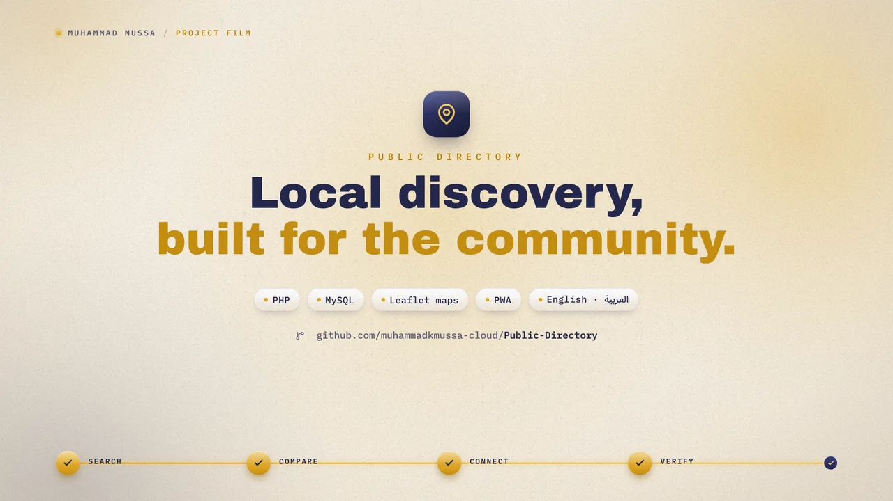

# Ummah Directory

https://github.com/user-attachments/assets/7f553be6-d574-4e49-8363-9eacc60374e1

[](https://github.com/user-attachments/assets/7f553be6-d574-4e49-8363-9eacc60374e1)

A Yelp-style directory for the Muslim community — **halal businesses, mosques with prayer times, and trusted fundis (skilled workers)** — with reviews, ratings, check-ins and search.

## Architecture

```
┌─────────────────────────────┐      fetch()/JSON       ┌──────────────────────────────┐
│  FRONTEND (static)          │ ──────────────────────▶ │  BACKEND (PHP 7.4+/MySQL)    │
│  HTML · CSS · vanilla JS    │ ◀────────────────────── │  /api/*.php  — REST-style JSON│
│  No server-side rendering   │    JSON responses       │  PDO prepared statements     │
└─────────────────────────────┘                         └──────────────────────────────┘
```

- **Frontend** — plain HTML files at the site root (`index.html`, `businesses.html`, `business.html`, …) plus shared `assets/css/style.css`, `assets/js/app.js` and one script per page in `assets/js/pages/`. No build step, no framework.
- **Backend** — PHP endpoints in `api/` that read/write MySQL. Sessions + CSRF for authentication. The frontend falls back to bundled sample data (`assets/js/mock.js`) if the API can't be reached — useful for previewing the design before the backend is installed.

## Project structure

```
├── index.html / businesses.html / business.html / mosques.html / mosque.html
│   fundis.html / fundi.html / login.html / register.html / profile.html / 404.html
├── assets/
│   ├── css/style.css            # all styles (Yelp-inspired, responsive)
│   ├── js/
│   │   ├── app.js               # API client, auth state, layout, card renderers
│   │   ├── mock.js              # sample data used only when the API is offline
│   │   ├── map.js               # Leaflet helpers (detail maps, results maps, Near-me)
│   │   ├── share.js             # Web Share API + share modal (WhatsApp/X/FB/Email/copy)
│   │   └── pages/*.js           # one script per page
│   └── img/                     # favicon + sample placeholder images
├── api/
│   ├── _bootstrap.php           # sessions, JSON helpers, CSRF, error handling
│   ├── auth.php                 # register / login / logout / me
│   ├── businesses.php           # list, search, filters, detail, featured
│   ├── mosques.php              # list, detail, prayer times (computed locally)
│   ├── fundis.php               # list, detail, portfolio
│   ├── reviews.php              # create / helpful / delete / my reviews
│   ├── checkin.php              # check-ins (businesses & mosques)
│   ├── categories.php           # category list
│   └── csrf.php                 # CSRF token endpoint
├── config/config.php            # ← EDIT: database credentials + app settings
├── includes/                    # Database, Auth, PrayerTimes classes
├── database/
│   ├── schema.sql               # full schema (28 tables) + base seed data
│   ├── seed.sql                 # sample businesses, mosques, fundis, reviews
│   └── install.php              # one-command installer
└── uploads/.htaccess            # blocks PHP execution in uploads
```

## Installation (DirectAdmin / shared hosting)

1. Upload the project to your web root (e.g. `public_html`).
2. Create a MySQL database and user in your control panel.
3. Edit `config/config.php` — set `DB_USER`, `DB_PASS`, `DB_NAME` (and `APP_ENV`).
4. Run the installer **once**:
   - SSH: `php database/install.php`
   - or web: open `https://yourdomain.com/database/install.php`
5. **Delete `database/install.php` (and `database/install.lock`) from the server.**
6. Done. Open your domain — the frontend will talk to `/api/*` automatically.

The installer creates the schema, loads sample data (30 businesses, 14 mosques, 11 fundis, 30+ reviews with owner responses, photo galleries, check-ins, emergency numbers, ads) and creates demo accounts (all pre-verified, so email confirmation isn't needed for them):

| Role | Login | Password |
|---|---|---|
| Admin | `admin@example.com` | `Admin@123` |
| User | `demo@example.com` | `Demo@123` |

### Sign in with Google (optional)

1. Go to [console.cloud.google.com](https://console.cloud.google.com) → *APIs & Services → Credentials → Create OAuth client ID* → **Web application**.
2. Add an **Authorized redirect URI** exactly: `https://yourdomain.com/api/oauth.php?action=callback`
3. Paste the client ID + secret into `config/config.php` (`GOOGLE_CLIENT_ID`, `GOOGLE_CLIENT_SECRET`).
4. **Set `APP_URL` explicitly in `config/config.php`** (e.g. `https://yourdomain.com`) — the redirect URI is built from it and Google requires an exact string match (protocol + host, no trailing slash). If the site is behind a proxy/Cloudflare, auto-detection may pick up the wrong scheme/host and Google will reject the callback.
5. A **"Continue with Google"** button appears on the login and register pages. First-time Google users get an account created automatically with their email pre-verified; users with an existing email/password account are linked on first Google login.
6. Without keys the site runs in **demo mode** — the button returns a simulated link so the UI is still testable.

### Email verification

- New registrations receive a one-time confirmation link (24h expiry). Accounts stay usable (soft gate) but show a **"Confirm email"** banner and a `verify.html` page for resending.
- Relies on the same `mail()` transport as password reset — make sure `SMTP_FROM_EMAIL` in `config/config.php` is a real, verifiable address (SPF/DKIM configured) so the emails aren't flagged as spam.
- In `APP_ENV=development` the confirmation link is returned in the API response so the flow can be tested without SMTP.

### Map & Near me

- Maps use **Leaflet + OpenStreetMap** — no API key required. List/Map toggles on businesses, mosques and fundis; detail pages have embedded maps.
- The **"📍 Near me"** button uses the browser Geolocation API (HTTPS required — `.htaccess` already allows it via `Permissions-Policy: geolocation=(self)`), then searches with `lat/lng/radius` and sorts by `distance_km`.

## Local preview without PHP

Open any `.html` file directly (or run `python3 -m http.server 8000`). The site detects that the API is unreachable and shows sample data with a small banner — perfect for previewing the design. Install the backend (above) for live data.

## API reference (quick)

All responses: `{"success": true, "data": ...}` or `{"success": false, "error": "..."}`.

| Endpoint | Method | Purpose |
|---|---|---|
| `api/auth.php?action=login` | POST | `{identifier, password}` |
| `api/auth.php?action=register` | POST | `{username, email, password, full_name, phone}` |
| `api/auth.php?action=logout` | POST | ends session |
| `api/auth.php?action=me` | GET | current user (or `data: null`) |
| `api/auth.php?action=forgot` | POST | `{email}` — sends reset link (returns token in dev mode) |
| `api/auth.php?action=reset` | POST | `{token, password}` — sets new password |
| `api/auth.php?action=verify` | POST | `{token}` — confirm email from the one-time link |
| `api/auth.php?action=resend_verification` | POST | `{email}` — resend confirmation (rate-limited) |
| `api/oauth.php?action=login&provider=google` | GET | redirects to Google (or returns a simulated link in dev mode) |
| `api/oauth.php?action=callback&provider=google` | GET | OAuth callback → logs in / creates account → `dashboard.html` |
| `api/csrf.php` | GET | `{csrf_token}` — send as `X-CSRF-Token` header |
| `api/businesses.php` | GET | `?q=&location=&category=&price=&min_rating=&sort=&page=&lat=&lng=&radius=` — `lat/lng/radius` (km) enable **Near me**: `distance_km` is returned per row and `sort=distance` orders by it (same on `api/mosques.php` + `api/fundis.php`) |
| `api/businesses.php?id=N` | GET | detail + photos + reviews + similar |
| `api/businesses.php?featured=1` | GET | homepage set |
| `api/mosques.php` / `?id=N` / `?top=1` | GET | list / detail (+prayer times) |
| `api/fundis.php` / `?id=N` / `?top=1` | GET | list / detail (+portfolio) |
| `api/categories.php?type=` | GET | category chips |
| `api/reviews.php?action=mine` | GET | your reviews (login) |
| `api/reviews.php` | POST | `{action: create\|react\|delete, ...}` — react: `{reaction: useful\|funny\|cool}` (login + CSRF) |
| `api/checkin.php` | POST | `{checkinable_id, checkinable_type, note}` (login + CSRF) |
| `api/ads.php?placement=` | GET | active ads for a placement (`search_results`, `homepage_header`, `detail_page`, …) |
| `api/ads.php` | POST | `{action: impression\|click, ad_id}` — track views/clicks (CSRF) |
| `api/ads.php` | POST | `{action: create\|toggle\|delete, ...}` — manage ads (admin, CSRF) |
| `api/ads.php?action=list` | GET | all ads + stats (admin) |
| `api/favorites.php?action=mine` | GET | your saved listings (login) |
| `api/favorites.php?action=status` | GET | `?favoritable_id=&favoritable_type=` → `{saved}` (login) |
| `api/favorites.php` | POST | `{action: toggle, favoritable_id, favoritable_type}` (login + CSRF) |
| `api/upload.php` | POST | multipart `image` + `dir` → secure upload (login + CSRF) |
| `api/suggest.php?q=` | GET | autocomplete suggestions (businesses/mosques/fundis/categories) |
| `api/activity.php` | GET | recent reviews feed for the homepage |
| `api/reports.php` | POST | `{action: create, reportable_id, reportable_type, reason, description}` (login + CSRF) |
| `api/businesses.php?action=mine` | GET | your claimed listings + pending responses (login) |
| `api/businesses.php` | POST | `{action: claim\|respond\|update, ...}` — owner tools (login + CSRF) |
| `api/charities.php` / `?id=N` / `?top=1` | GET | charities list / detail + campaigns / homepage |
| `api/donations.php` | POST | `{charity_id, campaign_id?, amount, payment_method: mpesa\|paypal\|bank, ...}` (CSRF) |
| `api/quotes.php` | POST | `{fundi_id, name, phone, description}` → stores request + returns a pre-filled WhatsApp link (CSRF) |
| `api/notifications.php` | GET | my notifications + unread count (login) |
| `api/notifications.php` | POST | `{action: read\|read_all}` (login + CSRF) |
| `api/reports.php?action=queue` | GET | moderation queue (admin) |
| `api/reports.php` | POST | `{action: admin_resolve, report_id, status: resolved\|rejected, notes}` (admin + CSRF) |

State-changing endpoints require login and the CSRF header (`X-CSRF-Token`), which the frontend attaches automatically.

## Security notes

- **SQL** — all queries via PDO prepared statements (no string concatenation of user input).
- **Passwords** — bcrypt (`HASH_COST`), plus a weak-password blocklist (common passwords,
  username/email-substring, repeated patterns) on register & reset.
- **Brute-force protection** — per-account lockout (10 failed logins → 15 min block) and
  per-IP rate limiting on auth, reviews, check-ins, donations, quotes, uploads, favorites and ads.
- **Sessions** — `httponly` + `SameSite=Lax` (+ `Secure` over HTTPS), `use_strict_mode`,
  `session_regenerate_id()` on login.
- **CSRF** — enforced on every state-changing API call (fetch token from `api/csrf.php`,
  send as `X-CSRF-Token`).
- **Headers** — Content-Security-Policy, X-Frame-Options, nosniff, Referrer-Policy,
  COOP/CORP, HSTS (Apache `.htaccess`); API responses are `no-store`.
- **Uploads** — `uploads/.htaccess` blocks all script execution; the upload API sniffs MIME
  (finfo), re-encodes via GD (strips EXIF/payloads), random filenames, thumbnails.
- **Sensitive files** — `.htaccess` denies `.sql`/`.log`/`.bak`/dotfiles and `install.php`.
- Review reactions (Useful / Funny / Cool) are stored per-user per-type in `review_helpful` (toggle).
- Sample image files in `assets/img/sample/` are placeholders — replace with real photos in production (uploaded files go to `uploads/`, which is git-ignored).

## Built

- **Notifications** — bell with unread badge in the header, dropdown + full
  notifications page; auto-created on new reviews (owner), claims and donations.
- **Admin moderation console** (`moderation.html`) — review the community's
  reports, resolve or reject with notes.
- **Multilingual (EN / SW / AR)** — language switcher in the header (persisted);
  dictionary-based translations for UI labels and static headings; category names
  use the DB's `name_sw` / `name_ar`; Arabic gets full RTL layout (`dir="rtl"`).
- **PWA** — `manifest.json` + service worker (`sw.js`) on all 19 pages:
  installable, offline app-shell cache, network-first pages.
- **SEO** — JSON-LD structured data (LocalBusiness / Place / Person) injected
  on business, mosque and fundi detail pages.
- **Charities & donations** — verified charities with campaigns and progress
  bars; donate via M-Pesa STK push (Daraja; sandbox simulates when no
  credentials are set), PayPal checkout link, or bank transfer. M-Pesa and
  PayPal credentials live in `config/config.php`.
- **Fundi quote requests via WhatsApp** — request form stores the request and
  opens WhatsApp with a pre-filled message to the fundi's number (messaging is
  WhatsApp-only by design; the `messages` table is unused).
- **Owner dashboard** (`dashboard.html`) — claim listings, edit your business
  (name, contact, price, descriptions), respond to customer reviews, see
  pending responses + per-listing stats (rating, check-ins).
- **Search autocomplete** — debounced suggestions on the homepage search and
  the businesses search (businesses, mosques, fundis, categories).
- **Report & moderation** — flag reviews or listings with a reason; stored in
  the `reports` table for admin review.
- **Badges & contributor levels** — verification badges (verified / premium /
  top contributor) and levels shown on reviews and profiles.
- **Recent Activity feed** on the homepage — the latest community reviews.
- **Map view** — Leaflet + OpenStreetMap: interactive map on search results
  (List/Map toggle with pins + popups) and embedded location maps on business,
  mosque and fundi pages.
- **Bookmarks** — save/unsave any listing (cards + detail pages), "Saved"
  section on your profile.
- **Review photos** — secure upload via `api/upload.php` (MIME sniff + GD
  re-encode + thumbnails), attached to reviews and displayed in review cards.
- **Open-now filter** — computed live from each business's `opening_hours`.
- **Password reset** — forgot/reset pages + API (token expiry, session
  invalidation; dev mode returns the link for testing without SMTP).
- **Sponsored ads** — Yelp-style sponsored results interleaved into search results,
  homepage banner strip, and detail-page sidebar; impression & click tracking;
  `admin.html` (admin-only) to create, pause and delete ads.
- Business claiming / owner dashboard (schema supports it)
- Photo uploads through `api/upload.php` (secure handler, ready to wire in)
- Multilingual UI (EN / SW / AR)

