<!-- Page 1 -->

# Ummah Directory Website Functionalities

## 1. Directory Functionality (Businesses & Service Providers)

**Listing Types:**

**Normal Category – basic listing with name, contact, location, short description.**
**Special Category – includes images, extended description, website link, and social media links.**
**Premier Category – featured on top of listings, highlighted background, verified badge, more gallery images, video embed, call-to-action buttons (WhatsApp, Call, Directions).**

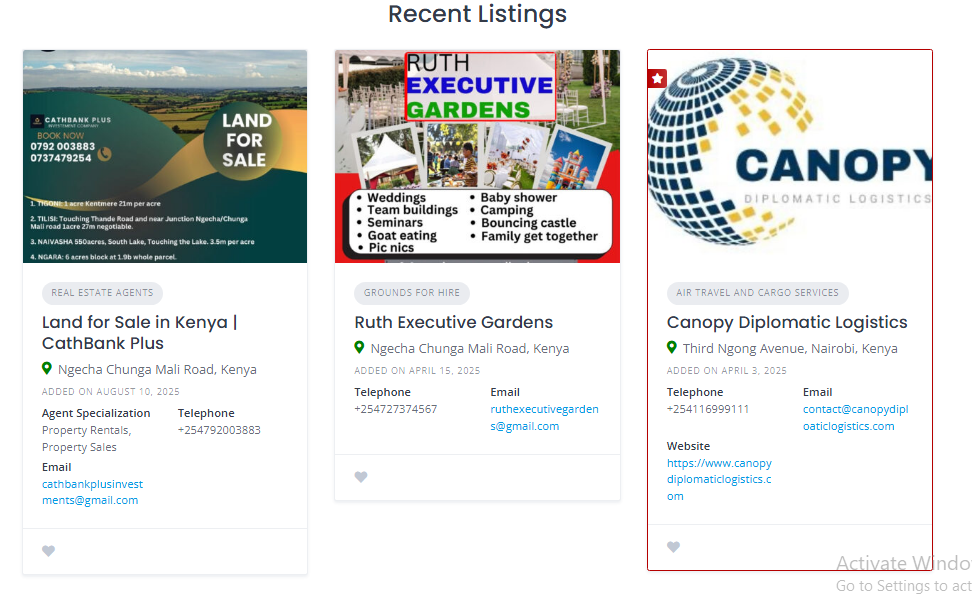

<!-- Page 2 -->

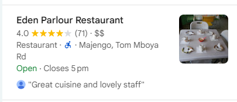

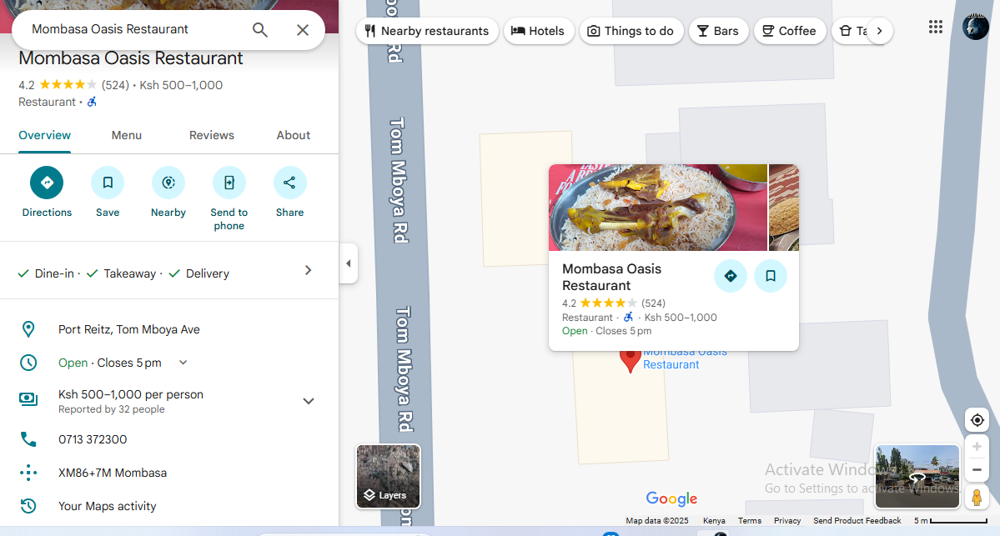

<!-- Page 3 -->

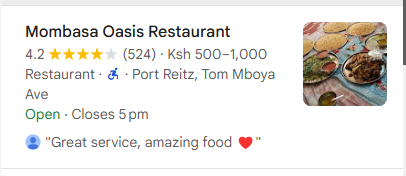

## 2. Mosques Directory

**Mosque Listings:**

Name, location, map, contact info, facilities (e.g., ablution, women’s prayer area, parking).

**Prayer Times Integration:**

Automatic calculation via an API (like Aladhan API).
Admin can manually adjust if needed.

**Features:**

Search mosques by area.
Mark mosque as “favorite.”

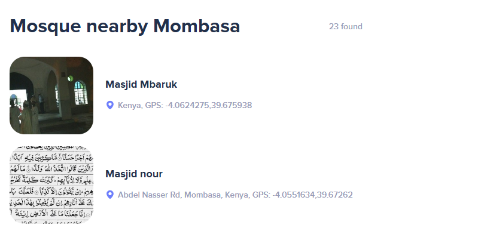

<!-- Page 4 -->

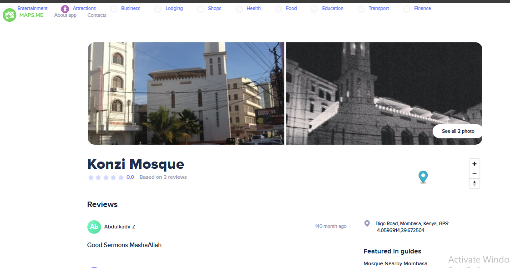

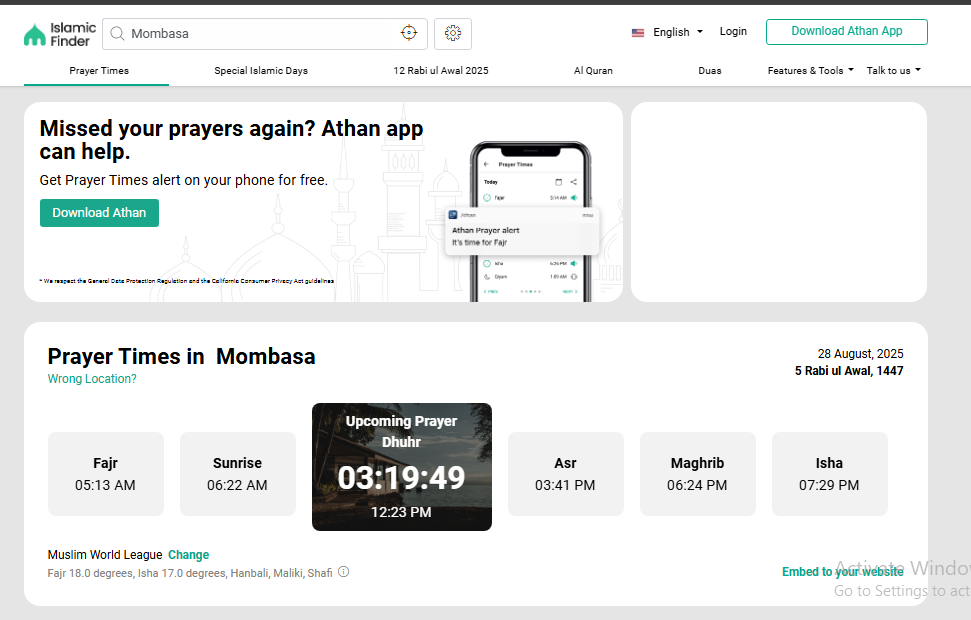

<!-- Page 5 -->

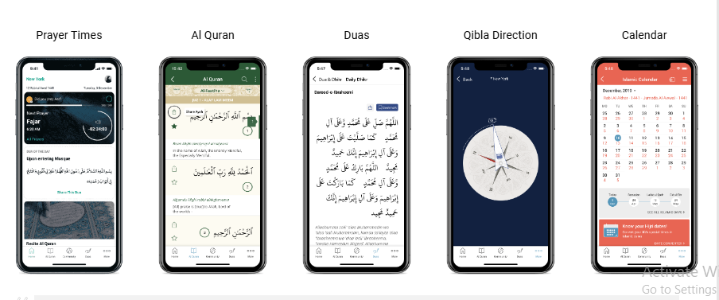

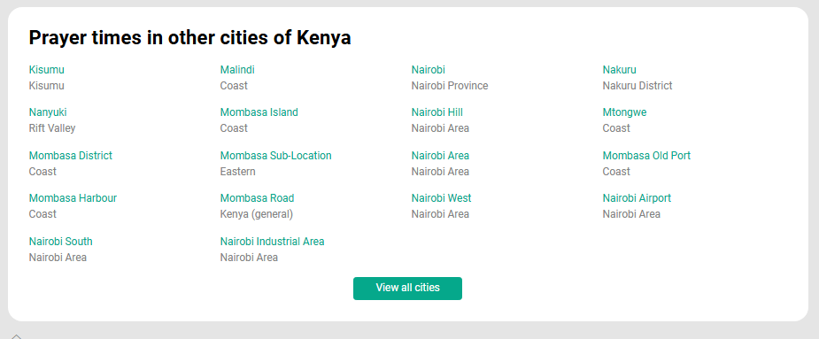

## 3. Fundis (Skilled Workers & Service Personnel)

**Profile Pages:**

Name, profession (plumber, carpenter, tailor, electrician, etc.), experience, contact info, location.

**Rating & Review System:**

Users can rate 1–5 stars.
Leave written reviews.

**Location Integration:**

GPS/Map integration to show fundis near the user

<!-- Page 6 -->

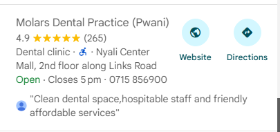

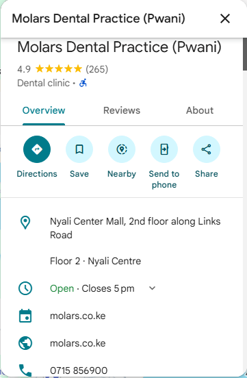

## 4. Advertising / Ads

**Ad Placements:**

<!-- Page 7 -->

Banner ads (homepage, sidebars, inside listings).
Sponsored listings (highlighted business/service).

**Ad Management System:**

Admin can upload ads (image, video, text).
Track impressions & clicks.

**Monetization:**

Businesses pay for ad space or premier listings.

## 5. Important Numbers

**Categories:**

Emergency services (Police, Ambulance, Fire).
Community hotlines (Hospitals, Helplines, NGOs).
Religious support (Islamic scholars, madrasa contacts).

**Quick Dial Feature:**

On mobile, users can click and call directly.

## 6. Charity & Donations

**Donation Categories:**

Zakat, Sadaqah, Masjid support, Emergency relief, Orphan support, etc.

**Payment Integration:**

Mobile money (M-Pesa), PayPal, Stripe, Bank transfer.

**Transparency:**

Show campaigns, progress bars, amount raised, donors (optional anonymous).

**Charity Listings:**

Organizations can register and post their campaigns.

<!-- Page 8 -->

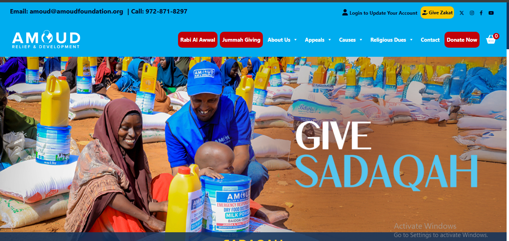

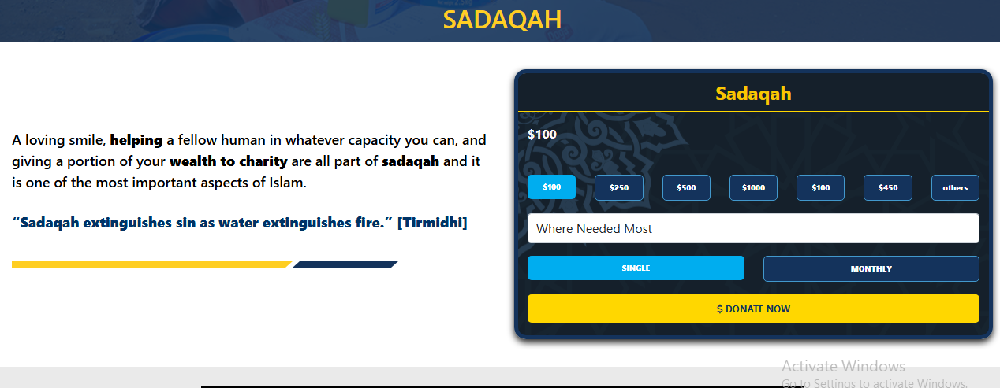

## Extra Features to Consider

**User Accounts:**

For business/service owners to manage their listings.
For users to save favorite listings, rate, or donate.

**Mobile-Friendly Design (priority since most users will use smartphones).**

**Multilingual Support (English & Swahili at minimum, maybe Arabic for religious parts).**

**Admin Dashboard:**

Manage listings, ads, donations, mosque data, reports.

**Notifications:**

<!-- Page 9 -->

Email/SMS/WhatsApp alerts for prayer times, new donations, community announcements

## Page Count Overview

**Main pages (public): ~9**

**User account pages: ~5**

**Backend (admin only): unlimited (handled by WP dashboard)**
